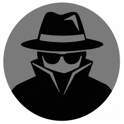

# CKF-Espionage-Mod
## Cyber Knights:Flashpoint Espionage Mod

<picture>
  <source media="(min-width:1080px)" srcset="./Images/Espionage_256.png">
  <source media="(min-width:720px)" srcset="./Images/Espionage_128.png">
  <source media="(min-width:650px)" srcset="./Images/Espionage_64.png">
  
</picture>
`Cyber Knights:Flashpoint`, or `CKF`, is a turn-based squad tactics RPG avalable on
[Steam](https://store.steampowered.com/app/1021210/Cyber_Knights_Flashpoint/).
Players lead a squad of hackers, mercs, and malcontents on their choice of heists,
navigating the power-player politics of 23rd-century cyberpunk New Boston to build
their rep and access ever-riskier and more rewarding missions.

This **Espionage Mod** expands the content of `Cyber Knights:Flashpoint` by introducing spy gear and
espionage-related activities. The goal is not to change the `CKF` gameplay but to enhance it
with content oriented toward stealth and intelligence operations.

[Official Cyber Knights:Flashpoint Wiki](https://cyberknightswiki.tresebrothers.com/).

[Cyber Knights: Flashpoint on Steam](https://store.steampowered.com/app/1021210/Cyber_Knights_Flashpoint/)

[Installing the Espionage Mod](https://steamcommunity.com/app/1021210/workshop/)

[Full Espionage Mod Documentation](./Docs/Main.md)

The **Espionage Mod** adds the following material to the base game:

* 18 new Items inspired by classic heist and espionage movies
* a new 'Spy Gear' Service to sell the Items
* a new Contact Type - 'Intelligence Officer'
* a new Contact, an Intelligence Officer working for the UNA
* 2 new espionage-related Proc-Gen Legwork jobs

In my Roadmap, I am planning and developing:

* a full storyline to introduce the UNA Intelligence Offier Contact
* at least 3 more Contacts
* at least 5 new Proc-Gen job types
* at least 2 new Leverage types
* a 'MilSec Spy Gear' Service (the more powerful Items will move to this new Service)
* a Power Play to get the 'MilSec Spy Gear' Service
* at least 1 more espionage Storyline
* ultimately, a new Era - the Cold War Era, spy vs. spy between Matsumoto and McKellen